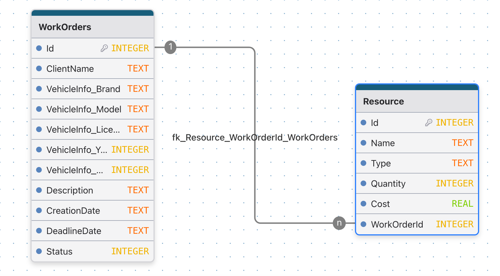
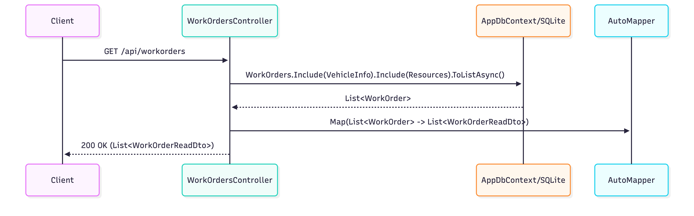
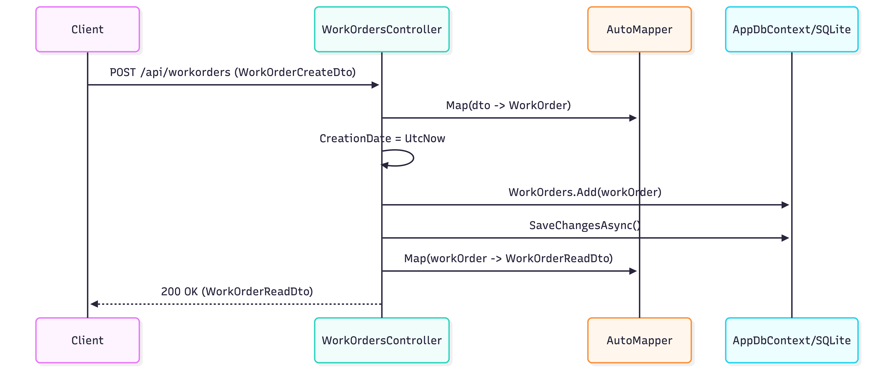
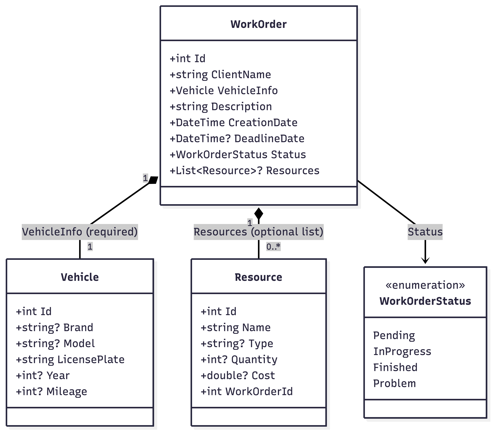

# TaskGarage Backend

## Setup

1. Install dependencies
```bash
dotnet restore
```

2. Run the API
```bash
dotnet run
```

3. Open Swagger
```bash
http://localhost:<port>/swagger
```

Default port is usually 5088 on macOS.

## Database
### SQLite
The API uses a local file `taskgarage.db`.


The file is automatically created on the first run after migrations.

Running migrations
```bash
dotnet ef migrations add InitialCreate
dotnet ef database update
```



## API Endpoints

### GET /api/workorders
Returns list of all work orders.

```
[
  {
    "id": 1,
    "clientName": "John Doe",
    "description": "Brake replacement",
    "creationDate": "2025-02-15T12:00:00",
    "deadlineDate": "2025-03-01T10:00:00",
    "status": 0,
    "vehicleInfo": {
      "brand": "VW",
      "model": "Golf",
      "licensePlate": "AB-1234",
      "year": 2014,
      "mileage": 120000
    },
    "resources": []
  }
]

```

### GET /api/workorders{id}

Returns a specific work order.

```
{
  "id": 1,
  "clientName": "John Doe",
  "description": "Brake replacement",
  "creationDate": "2025-02-15T12:00:00",
  "deadlineDate": "2025-03-01T10:00:00",
  "status": 1,
  "vehicleInfo": {
    "brand": "VW",
    "model": "Golf",
    "licensePlate": "AB-1234",
    "year": 2014,
    "mileage": 120000
  },
  "resources": [
    {
      "id": 4,
      "name": "Brake Pads",
      "type": "Part",
      "quantity": 2,
      "cost": 89.90
    }
  ]
}
```



### POST /api/workorders
Creates a new work order

```
{
  "clientName": "John Doe",
  "description": "Brake replacement",
  "creationDate": "2025-12-01T10:00:00",
  "status": 0,
  "vehicleInfo": {
    "brand": "VW",
    "model": "Golf",
    "licensePlate": "AB-1234",
    "year": 2014,
    "mileage": 120000
  },
  "resources": []
}
```

Response (201 Created)

```
{
  "id": 1,
  "message": "Work order created."
}

```



# PUT — Full Update
Endpoint
PUT /api/workorders/{id}

Purpose

Updates a work order by replacing its editable fields using a full data object.

Request Body

WorkOrderPutDto (JSON)

Example Request
```bash
curl -X PUT "http://localhost:5088/api/workorders/5" \
  -H "Content-Type: application/json" \
  -d '{
    "clientName": "John Doe",
    "description": "Brake replacement",
    "status": 1,
    "vehicleInfo": {
      "brand": "BMW",
      "model": "X3",
      "licensePlate": "ZH-12345",
      "year": 2020,
      "mileage": 40000
    },
    "resources": [
      { "name": "Brake pads", "type": "Part", "quantity": 1, "cost": 120.00 },
      { "name": "Brake fluid", "type": "Material", "quantity": 1, "cost": 25.00 }
    ]
  }'

```

Responses
Status	Meaning
200 OK	Work order successfully updated
404 Not Found	Work order ID does not exist

## PATCH — Partial Update
Endpoint
PATCH /api/workorders/{id}

Purpose

Updates only selected fields of a work order.

Request Body

WorkOrderUpdateDto

Example Request
```bash
curl -X PATCH "http://localhost:5088/api/workorders/5" \
  -H "Content-Type: application/json" \
  -d '{
    "status": 2,
    "description": "Repair completed successfully"
  }'
```

Responses
Status	Meaning
200 OK	Work order successfully updated
404 Not Found	Work order ID does not exist

### Example CURL Request

Create a work order.
```
curl -X POST http://localhost:5088/api/workorders \
-H "Content-Type: application/json" \
-d '{
  "clientName": "John Doe",
  "description": "Brake replacement",
  "creationDate": "2025-12-01T10:00:00",
  "status": 0,
  "vehicleInfo": { "brand": "VW", "model": "Golf", "licensePlate": "AB-1234" },
  "resources": []
}'

curl -X POST https://taskgaragebackend-clf3.onrender.com/api/workorders \
-H "Content-Type: application/json" \
-d '{
  "clientName": "John Doe",
  "description": "Brake replacement",
  "creationDate": "2025-12-01T10:00:00",
  "status": 0,
  "vehicleInfo": { "brand": "VW", "model": "Golf", "licensePlate": "AB-1234" },
  "resources": []
}'

```

## Using SQLite on Mobile
When running the API on a phone `taskgarage.db`is created inside the app`s sandboxed storage.


## Domainmodell 


